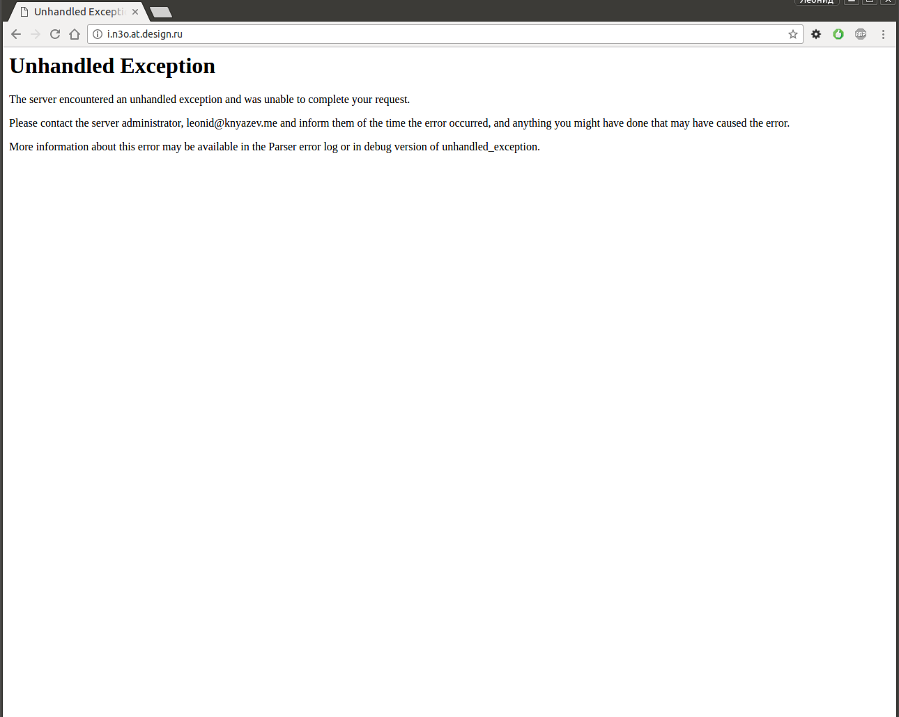
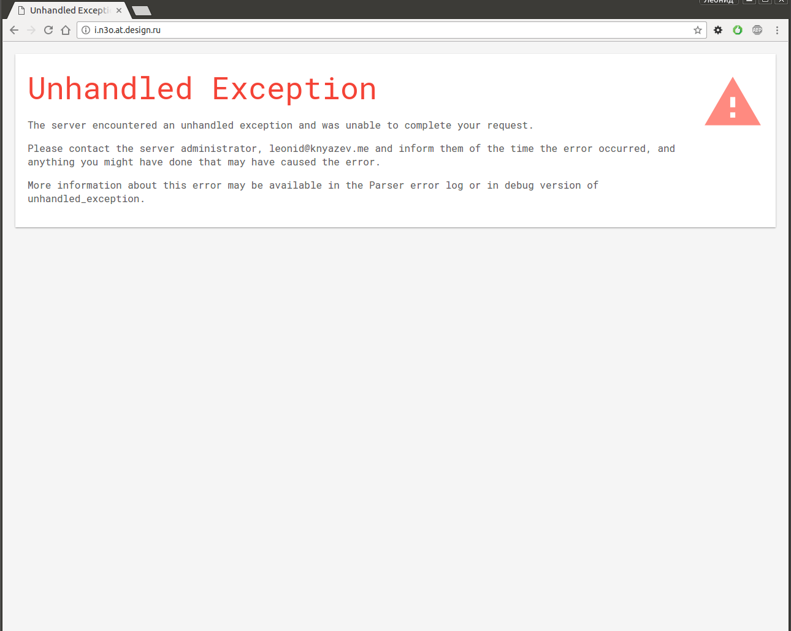
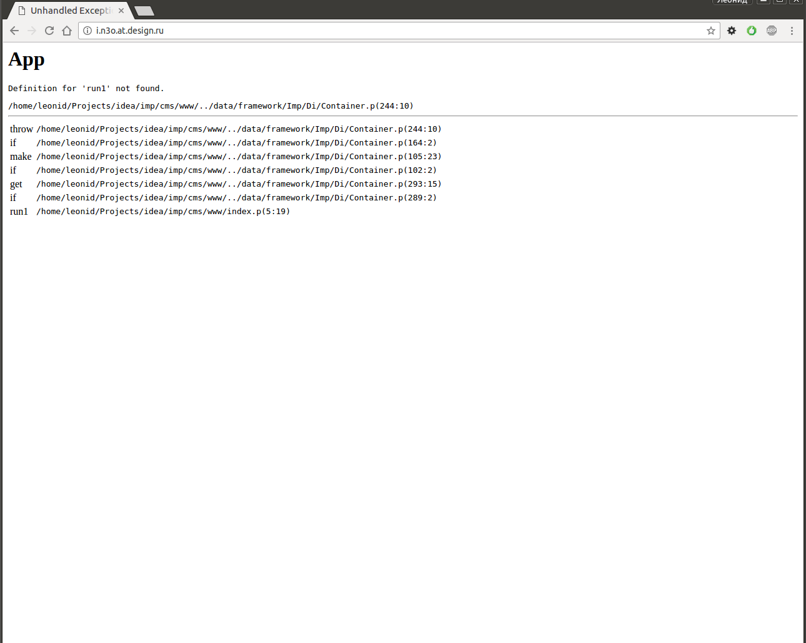

# Als/Exception

Шаблонизатор «исключений» Парсера с показом участка кода и подстветкой строки вызвавшей исключение.


## Installation

```bash
$ composer require als/exception
```


## Basic Usage

Для подключения необходимо в корневом auto.p перекрыть метод `@unhandled_exception[]`:

```ruby
###############################################################################
@unhandled_exception[exception;stack]
$result[^Als/Exception:render[
	$.debug(true)
	$.exception[$exception]
	$.stack[$stack]
	$.lines(20)
]]
# End: @unhandled_exception[]
```

### Params

* $.debug `<bool|method>` Ссылка на метод @is_developer[], либо результат его выполнения
* $.exception `<hash>` Информация об ошибке
* $.stack `<table>` Стек вызовов
* $.lines `<int>` Кол-во строк кода, которые будут показаны для каждой строки в стеке вызовов


## "Release" режим
| Было | Стало |
| :---------: | :---------------: |
| [](doc/img/default.release.png) | [](doc/img/templated.release.png) |

---

## "Debug" режим
| Было | Стало |
| :---------: | :---------------: |
| [](doc/img/default.debug.png) | [](doc/img/templated.debug.png) |

---


## References

- Bugs and feature request are tracked on [GitHub](https://github.com/parser3/als.exception/issues)
